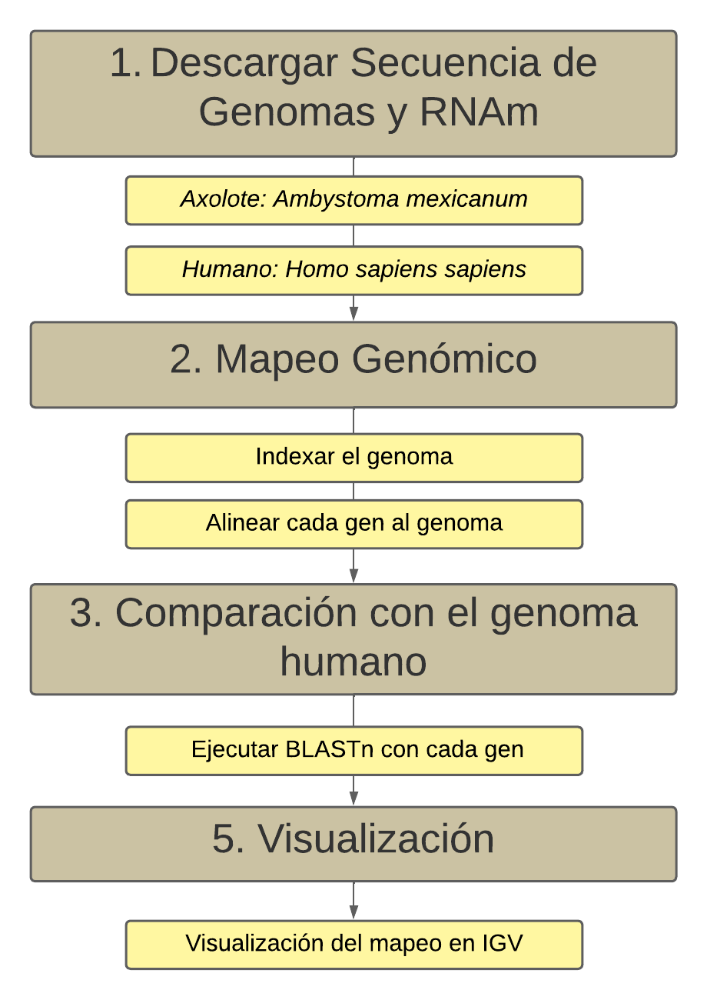

# Mapeo de genes regenerativos de _Ambystoma mexicanum_ y comparación con genoma humano

### Autor: Andrés Murillo
Email: afmurilloy@puce.edu.ec

## Introduccion 

 Ambystoma mexicanumes una especie endémica de México que ha sido atractivo para la comunidad cientifica dada sus capacidades regenerativas y su particular genoma, esto lo convierte en un modelo ideal para terapia de tejidos,
 Aunque se considera que esta especie cuenta con un genoma de tamaño medio con ~32 x 10 pb distribuidos en 14 cromosomas haploide (Tobó & Jimenez, 2021) quedan aun misterios por decifrar. 
 Principales genes Prrx1,Evi5, TGF-B
 

## Programas requeridos

- EDirect
- BWA
- Samtools
- BEDTools
- BLAST+

## Program WorkFlow

## Instrucciones 

## Resultado esperado

# BIBLIOGRAFÍA 
Tobón, N. A. A., Arellano, G. E. C., & Jiménez, O. V. (2021). Ambystoma mexicanum, la importancia de esta especie en la medicina regenerativa y estrategias para su conservación. RD-ICUAP, 1-16.
