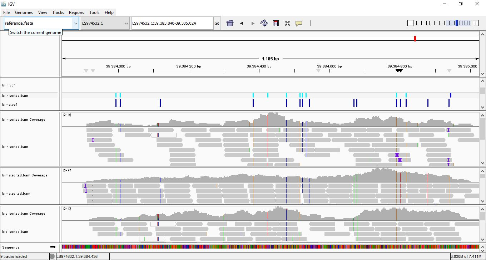

# Detección de variantes en el gen FT en plantas como _Brassica incana_, _Brassica oleracea_ y _Brassica macrocarpa_

-----------------------------------

### Autor: Andrés Murillo
Email: afmurilloy@puce.edu.ec

---------------------------------------

## Introduccion 

El gen FT desempeña un papel central en la regulación de la floración en plantas, actuando como una señal móvil que se sintetiza en las hojas en respuesta a estímulos ambientales, especialmente el fotoperíodo, y se transporta al meristemo apical para inducir la transición de la fase vegetativa a la reproductiva (Turck et al., 2008). En el género Brassica, que incluye especies como _Brassica incana_, _Brassica oleracea_ y _Brassica macrocarpa_, la regulación de la floración es un rasgo clave para su adaptación ecológica y su manejo agronómico. Estas especies, además de su valor como cultivos o como modelos de estudio en evolución y domesticación, presentan variabilidad en la respuesta a estímulos ambientales, lo que sugiere posibles diferencias estructurales o regulatorias en genes como FT (Mabry et al., 2022).

El mapeo genómico del gen FT en estas especies es de gran importancia porque permite identificar variantes genéticas que podrían explicar diferencias en la fenología, comprender la evolución del control de la floración dentro del género y facilitar el desarrollo de marcadores moleculares útiles para programas de mejoramiento. Además, al comparar las secuencias codificantes y promotoras del FT entre especies silvestres y domesticadas de Brassica, se pueden identificar patrones de conservación o divergencia funcional relevantes para su adaptación a distintas condiciones climáticas (Schiessl et al., 2019). Por ello, estudiar la localización, estructura y variación del gen FT contribuye tanto al conocimiento fundamental sobre la biología del desarrollo en plantas como a aplicaciones prácticas en agricultura y conservación.
 

 
-------------------------------------

## Programas requeridos

- SAMTOOLS
-- [`Instalar aquí`](http://www.htslib.org/)
- BWA
-- [`Instalar aquí`](http://bio-bwa.sourceforge.net/)
- BCFTOOLS
-- [`Instalar aquí`](http://www.htslib.org/)
- TRIMMOMATIC
-- [`Instalar aquí`](http://www.usadellab.org/cms/?page=trimmomatic)
- IGV
-- [`Instalar aquí`](https://igv.org)

-----------------------------------------

## Program WorkFlow

1. **Descarga e indexación del genoma de referencia**
   - Se descarga el genoma de *Brassica oleracea* (`referencia.fasta`)
   - Indexación con `samtools faidx` y `bwa index`

2. **Descarga de datos de secuenciación**
   - FASTQ de *Brassica incana*, *Brassica oleracea* y *Brassica macrocarpa*  desde el SRA

3. **Filtrado de calidad**
   - Uso de `Trimmomatic` para limpiar lecturas: remoción de bases de baja calidad

4. **Mapeo de lecturas**
   - Alineación al genoma con `bwa mem` para obtener archivos `.sam`

5. **Procesamiento de alineamientos**
   - Conversión a `.bam`, ordenamiento e indexación con `samtools`

6. **Llamado de variantes**
   - Con `bcftools mpileup` y `bcftools call` → archivos `.vcf.gz` por especie

----------------------------------

## Instrucciones 

La manera mas fácil de correr el programa es descargar todas las dependencias y el programa "SCRIPT.sh" este programa se puede
ejecutar desde la terminal poniendo `bash SCRIPT.sh`

Si no se esta ejecutando en un supercomputador se debe quitar el encabezado y empezar desde # Descargar genoma completo de Brassica oleracea
De todas formas dejo un script sin encabezado pero es importante descargar los programas de dependencia por separado

--------------------------------

## Resultado esperado

Luego de correr el programa se espera obtener los siguientes archivos: 

- `*.sorted.bam`: lecturas alineadas que serán visibles en IGV 

- `*.vcf`: archivos generados para encontrar single nucleotide variants (SNVs) 

### Ejemplo de visualización en IGV

Esto es un ejemplo de como debería verse los resultados en IGV. Las partes grises muestra que la lectura esta alineada y que coincide perfectamente con la secuencia de referencia.
Los demas colores marcan bases individuales que NO coinciden con la referencia en esa posición.Estos colores te indican posibles SNPs, que también suelen coincidir con las variantes marcadas en el archivo .vcf.
Si una especie muestra variantes que otras no tienen, esto sugiere diferencias genéticas que podrían afectar la función o regulación del gen FT. Además, el histograma gris de cobertura indica cuántas lecturas cubren cada posición: una cobertura alta valida las variantes, mientras que zonas vacías pueden señalar regiones ausentes o mal secuenciadas. Así, este mapeo permite comparar la secuencia del gen FT entre especies y detectar cambios que podrían estar relacionados con diferencias en el tiempo de floración.

------------------------------------

# Agradecimientos

Un especial agradecimiento al Profesor Daniel Eduardo Chávez Viteri. Por darnos la clase y enseñarnos lo que sabemos hoy.

# BIBLIOGRAFÍA 
- Mabry, M. E., Turner-Hissong, S. D., Gallagher, E. Y., McAlvay, A. C., An, H., Edger, P. P., ... & Pires, J. C. (2021). The evolutionary history of wild, domesticated, and feral Brassica oleracea (Brassicaceae). Molecular Biology and Evolution, 38(10), 4419-4434.
- Schiessl, S., Huettel, B., Kuehn, D., Reinhardt, R., & Snowdon, R. J. (2017). Targeted deep sequencing of flowering regulators in Brassica napus reveals extensive copy number variation. Scientific data, 4(1), 1-10.
- Turck, F., Fornara, F., & Coupland, G. (2008). Regulation and identity of florigen: FLOWERING LOCUS T moves center stage. Annual Review of Plant Biology, 59, 573–594. https://doi.org/10.1146/annurev.arplant.59.032607.092755
- Zhang, H., Zhao, X., Li, J., Cai, H., Deng, X. W., & Li, L. (2014). MicroRNA408 is critical for the HY5-SPL7 gene network that mediates the coordinated response to light and copper. The Plant Cell, 26(12), 4933-4953.